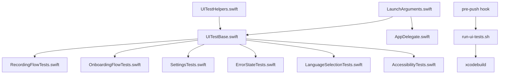

# Implementation Plan: Expand XCUITest Coverage and Pre-Push Hook Integration

**Branch**: `001-ui-test-expansion` | **Date**: 2026-01-03 | **Spec**: [spec.md](spec.md)
**Input**: Feature specification from `/specs/001-ui-test-expansion/spec.md`

## Summary

Expand the existing XCUITest suite to provide comprehensive E2E coverage for the SpeechToText macOS application, covering recording flows, onboarding, settings, error states, language selection, and accessibility. Integrate UI tests into the pre-push hook workflow with configurable flags (`--skip-ui-tests`, `--ui-tests-only`) to balance thoroughness with developer velocity.

## Technical Context

**Language/Version**: Swift 5.9 (with Swift 6 concurrency warnings)
**Primary Dependencies**: XCTest, XCUITest, AVFoundation, FluidAudio SDK
**Storage**: UserDefaults for settings, not directly tested
**Testing**: XCTest/XCUITest for E2E, existing unit test suite (24 files)
**Target Platform**: macOS 14+ (Sonoma)
**Project Type**: Single macOS application (menu bar + windows)
**Performance Goals**: UI tests complete in <5 minutes, pre-push hook <10 minutes total
**Constraints**: Menu bar extras have limited XCUITest support; global hotkeys require workarounds
**Scale/Scope**: 15+ distinct test scenarios across 8 user stories
**Test Execution**: All tests run on `macdev` remote Mac via SSH (macOS hardware required, GitHub runners not suitable)

## Constitution Check

_GATE: Must pass before Phase 0 research. Re-check after Phase 1 design._

| Principle | Status | Notes |
|-----------|--------|-------|
| **1.1 Modern TypeScript-First** | N/A | Swift project, not TypeScript |
| **1.2 Specification-Driven** | PASS | Full spec exists with acceptance criteria |
| **1.3 Security-First** | PASS | No secrets in test code, launch args are safe |
| **3.1 Mandatory Patterns** | PASS | Using XCTest (native), explicit typing, DI patterns |
| **3.2 Prohibited Patterns** | PASS | No `any` types, proper error handling |
| **6.1 TDD Methodology** | PASS | Test infrastructure first, then implementation |
| **6.2 Vitest Framework** | N/A | Swift uses XCTest, not Vitest |
| **6.4 Coverage Requirements** | PARTIAL | UI tests don't contribute to code coverage |

**Constitution Compliance**: PASS - No violations. Swift project follows Swift-specific patterns from AGENTS.md which supersede web-focused constitution rules.

## Project Structure

### Documentation (this feature)

```text
specs/001-ui-test-expansion/
├── plan.md              # This file
├── research.md          # Phase 0 output (complete)
├── data-model.md        # Phase 1 output (complete)
├── quickstart.md        # Phase 1 output (complete)
├── contracts/           # Phase 1 output (complete)
│   ├── ui-test-helpers.swift
│   ├── launch-arguments.swift
│   ├── pre-push-hook.sh
│   └── test-scenarios.md
└── tasks.md             # Phase 2 output (from /speckit.tasks)
```

### Source Code (repository root)

```text
# Existing structure (unchanged)
Sources/
├── SpeechToTextApp/     # App entry point (modify for launch arg handling)
├── Services/            # Business logic (add mock support for testing)
├── Models/              # Data structures (add UITestConfiguration)
├── Views/               # SwiftUI views (ensure accessibility labels)
└── Utilities/           # Extensions, constants (add LaunchArguments)

Tests/
└── SpeechToTextTests/   # Existing unit tests (24 files, unchanged)

# New/Modified structure
UITests/
├── Base/
│   ├── UITestBase.swift           # NEW: Base class with setup/teardown
│   └── UITestHelpers.swift        # NEW: Helper functions
├── P1/
│   ├── RecordingFlowTests.swift   # NEW: Recording modal tests
│   └── TestInfrastructureTests.swift # NEW: Screenshot, helpers tests
├── P2/
│   ├── OnboardingFlowTests.swift  # REFACTOR: From SpeechToTextUITests.swift
│   ├── SettingsTests.swift        # NEW: Settings window tests
│   └── ErrorStateTests.swift      # NEW: Error UI tests
├── P3/
│   ├── LanguageSelectionTests.swift # NEW: Language picker tests
│   └── AccessibilityTests.swift   # NEW: VoiceOver/keyboard tests
├── TestPlans/
│   ├── AllUITests.xctestplan      # NEW: All UI tests
│   ├── P1OnlyTests.xctestplan     # NEW: Quick validation
│   └── AccessibilityTests.xctestplan # NEW: A11y tests only
└── SpeechToTextUITests.swift      # MODIFY: Convert to imports/legacy

scripts/
├── run-ui-tests.sh                # MODIFY: Add test plan support
└── pre-push                       # MODIFY: Add UI test integration
    (in .git/hooks/)
```

**Structure Decision**: Single macOS application with extended UITests directory. Follows existing pattern of `Tests/` for unit tests and `UITests/` for UI tests. Priority-based subdirectories (P1, P2, P3) enable selective test execution.

## Implementation Phases

### Phase 1: Test Infrastructure (P1 - Critical)

**Goal**: Establish foundational test utilities and base classes

**Tasks**:

1. Create `UITests/Base/UITestBase.swift` with common setup/teardown
2. Create `UITests/Base/UITestHelpers.swift` with utility functions
3. Add screenshot capture on test failure
4. Implement launch argument parsing in `Sources/Utilities/LaunchArguments.swift`
5. Modify `AppDelegate.swift` to handle new launch arguments

**Acceptance**:

- UITestBase provides consistent app launch
- UITestHelpers simplifies common operations
- Screenshots captured for all failures
- Launch arguments work for test configuration

### Phase 2: Pre-Push Hook Enhancement (P1 - Critical)

**Goal**: Integrate UI tests into git workflow via remote Mac (macdev)

**Tasks**:

1. Modify `scripts/run-ui-tests.sh` to support `--test-plan` flag
2. Modify `scripts/remote-test.sh` to include UI tests in remote execution
3. Update `.git/hooks/pre-push` to call remote tests via SSH to macdev
4. Add environment variable support (`SKIP_UI_TESTS`, `UI_TESTS_ONLY`, `UI_TEST_TIMEOUT`)
5. Implement result parsing and clear error output
6. Add timeout handling for xcodebuild

**Acceptance**:

- `SKIP_UI_TESTS=1 git push` works (runs on macdev via SSH)
- `UI_TESTS_ONLY=1 git push` works (runs on macdev via SSH)
- Failures block push with clear messages
- Timeout after 10 minutes by default
- All tests execute on macdev remote Mac (not GitHub Actions)

### Phase 3: Recording Flow Tests (P1 - Critical)

**Goal**: Comprehensive tests for core recording functionality

**Tasks**:

1. Create `UITests/P1/RecordingFlowTests.swift`
2. Implement test for recording modal appearance (`--trigger-recording`)
3. Implement test for waveform visibility
4. Implement test for cancel/escape dismissal
5. Implement test for stop button initiating transcription

**Acceptance**:

- 5 recording flow tests pass
- Tests work without manual hotkey trigger
- Modal state transitions verified

### Phase 4: Onboarding Tests (P2)

**Goal**: Complete onboarding flow coverage

**Tasks**:

1. Refactor existing `SpeechToTextUITests.swift` onboarding tests
2. Create `UITests/P2/OnboardingFlowTests.swift`
3. Add tests for each onboarding step
4. Add test for skip warning dialog
5. Add test for onboarding completion

**Acceptance**:

- 4 onboarding tests pass
- Tests work with `--reset-onboarding`
- Permission steps handled via mock

### Phase 5: Settings & Error Tests (P2)

**Goal**: Settings window and error state coverage

**Tasks**:

1. Create `UITests/P2/SettingsTests.swift`
2. Create `UITests/P2/ErrorStateTests.swift`
3. Implement settings window open test
4. Implement language tab test
5. Implement settings persistence test
6. Implement reset to defaults test
7. Implement permission denied error tests
8. Implement transcription error test

**Acceptance**:

- 4 settings tests pass
- 3 error state tests pass
- Error UI shows appropriate messages

### Phase 6: Language & Accessibility Tests (P3)

**Goal**: Language selection and accessibility compliance

**Tasks**:

1. Create `UITests/P3/LanguageSelectionTests.swift`
2. Create `UITests/P3/AccessibilityTests.swift`
3. Implement language search filter test
4. Implement language indicator test
5. Implement VoiceOver label tests
6. Implement keyboard navigation test

**Acceptance**:

- 3 language tests pass
- 3 accessibility tests pass
- All interactive elements have a11y labels

### Phase 7: Documentation & Cleanup

**Goal**: Update documentation and finalize

**Tasks**:

1. Update `CLAUDE.md` with new test commands
2. Update `AGENTS.md` with UI testing patterns
3. Create test plans (`*.xctestplan` files)
4. Remove deprecated code from `SpeechToTextUITests.swift`
5. Verify all success criteria met

**Acceptance**:

- Documentation reflects new capabilities
- Test plans enable selective execution
- All SC-001 through SC-008 verified

## Dependencies and Integration Points

### Internal Dependencies

| Component | Integration Point | Notes |
|-----------|-------------------|-------|
| AppDelegate | Launch argument handling | Modify `applicationDidFinishLaunching` |
| PermissionService | Mock implementation | Use protocol-based injection |
| RecordingViewModel | Error simulation | Add error injection for tests |
| SettingsService | State reset | Support `--reset-onboarding` |

### External Dependencies

| Dependency | Purpose | Version |
|------------|---------|---------|
| XCTest | Test framework | System (Xcode 15+) |
| XCUITest | UI automation | System (Xcode 15+) |
| xcodebuild | Test execution | Command line tools |

### File Dependencies



## Testing Strategy

### Test Layers

| Layer | Coverage | Tools |
|-------|----------|-------|
| Unit | 80%+ | XCTest, mocks |
| UI E2E | 15+ flows | XCUITest |
| Integration | Implicit via E2E | XCUITest |

### Test Execution Matrix

| Scenario | Unit Tests | UI Tests | Trigger |
|----------|------------|----------|---------|
| Local dev (macdev) | Manual | Manual | `swift test`, `./scripts/run-ui-tests.sh` |
| Pre-push (macdev) | Auto via SSH | Auto via SSH | `git push` (runs on macdev) |
| Pre-push (quick) | Auto via SSH | Skip | `SKIP_UI_TESTS=1 git push` |
| Remote test | Auto via SSH | Auto via SSH | `./scripts/remote-test.sh` |

**Note**: All tests require macOS hardware. Tests run on the `macdev` remote Mac via SSH, not GitHub Actions runners (which don't satisfy macOS hardware requirements).

### Risk Mitigation

| Risk | Mitigation |
|------|------------|
| Flaky UI tests | Explicit waits, retry logic, screenshot capture |
| Slow tests | P1 quick test plan, skip flags |
| Permission dialogs | Mock service via launch args |
| Menu bar limitations | Use notification-based triggers |

## Success Criteria Verification

| ID | Criterion | Verification Method |
|----|-----------|---------------------|
| SC-001 | 15+ user flows | Count test methods in P1/P2/P3 |
| SC-002 | <10 min pre-push | Time actual hook execution |
| SC-003 | 100% screenshot capture | Intentionally fail tests, verify screenshots |
| SC-004 | Tests pass on clean install | Run with `--reset-onboarding` |
| SC-005 | 50% time reduction with skip | Compare hook times |
| SC-006 | CLAUDE.md updated | Review documentation changes |
| SC-007 | 80% a11y labels | Run AccessibilityTests |
| SC-008 | No unit test regressions | `swift test` passes |

## Complexity Tracking

No constitution violations requiring justification. The implementation follows:

- Native XCTest framework (no new dependencies)
- Existing launch argument pattern
- Standard XCUITest patterns for macOS
- Minimal changes to production code

## Next Steps

1. Run `/speckit.tasks` to generate detailed task breakdown
2. Create feature branch `001-ui-test-expansion`
3. Begin Phase 1 implementation
4. Iterate through phases with TDD approach
